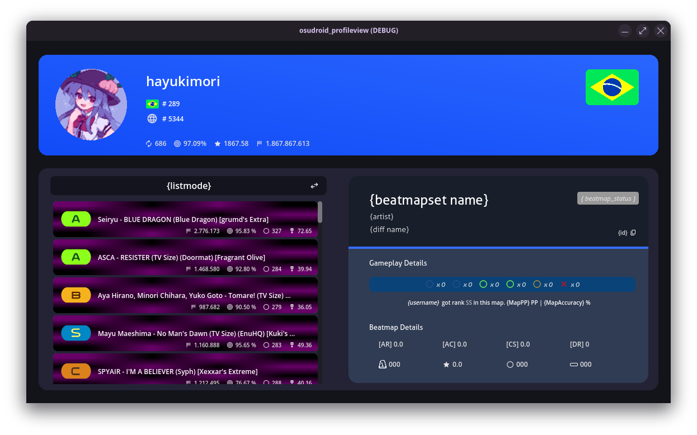

---

# Osu!Droid Profile View

 

Osu!Droid Profile View is a project made in godot that allows to search and view profile info, like recent played beatmaps and player top plays.

### Downloads
There are currently no downloads available, the reason is that the application is under development, and may contain bugs.

